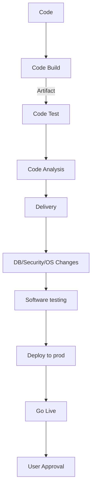

### Lifecycle

### Continuous integration
#integracion_continua
Se refiere al hecho de automatizacion del proceso de creacion y empaquetado del software al cliente  partiendo desde la codificacion de la solucion hasta las pruebas del software. Es una practica que se refiere a la fase de creacion o integracion del proceso de publicacion de software y conlleva un componente de automatizacion (CI o servicio de versiones) y un componente cultural (aprender a integrar con frecuencia). El objetivo clave es encontrar y arreglar errores con mayor rapidez, mejorar la calidad del software y reducir el tiempo que se tarda en validar y publicar las nuevas actualizaciones del software

![[Pasted image 20220906193557.png]]

Con la [[#Continuous Delivery|entrega continua]] se crean, prueban y preparan automaticamente los cambios en el codigo y se entregan para la fase de produccion.

### Continuous Delivery
#entrega_continua
Es una practica en el desarrollo de software mediante la cual se preparan automaticamente los cambios en el codigo y se entregan a la fase de produccion. Se implementan todos los cambios en el codigo en un ambiente de pruebas o de produccion despues de la fase de compilacion, esto permite a los desarrolladores entregarles un artefacto listo para su implementacion que se ha sometido a un proceso  de pruebas estandarizado. La desicion de su implementacion en un entorno de produccion depende del desarrollador.