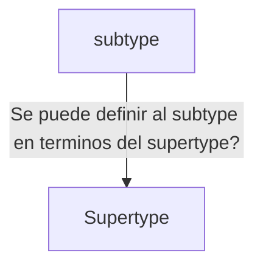

aliases: [js, java]
[[Java]]

### Restricciones/ tecnicas de implementacion SOLID

#### Open/Close
#open/Close #principio_de_substitucion
	- Argumentos de **types**: Argumentos de los **types** hijos deben ser equivalentes o mas que aquellos argumentos del padre
	- Retorno de **types**: El retorno de los **subtypes** debe ser menor o equivalente que los retornos de aquellos metodos sobreescritos
	- Excepciones: Las excepciones que un **subtype** puede ser disparar son menores a las del **supertype** 
	- Invariabilidad: Los **subtypes** deben permanecer invariables en aquellos limites o definiciones que los **supertypes** definieron desde el principio
	- Historico de restricciones: Los **subtypes** deben respetar las restricciones que los **supertypes** definieron sin importar si se requieren alterar en la implementacion futura
	- Precondiciones: Los **subtypes** pueden relajar las restricciones que los **supertypes** implementan pero no deben acortarlas aun mas que las ya establecidas en los **supertypes**, permitiendo asi que los reemplazos de **subtypes** en terminos de **supertypes** sean permitidos
	- Postcondiciones: Los **subtypes** pueden fortalecer las restricciones que los **supertypes** implementan pero no deben relajarlas mas, permitiendo que teniendo postcondiciones mas robustas que los supertypes las condiciones permitan reemplazar **subtypes** en terminos de **supertypes**. Mientras que postcondiciones mas endebles no garantizan que las postcondiciones de los **subtypes** sean reemplazables en terminos de **supertypes**

